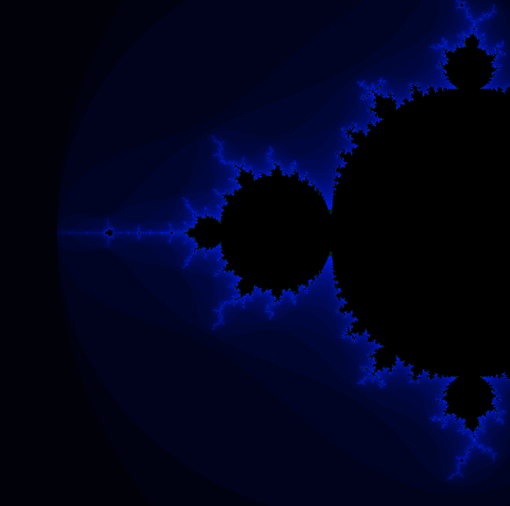
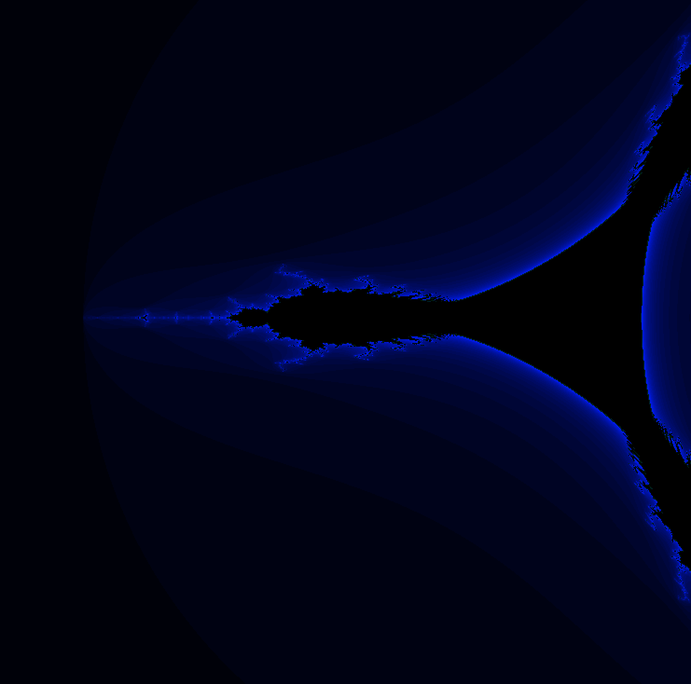
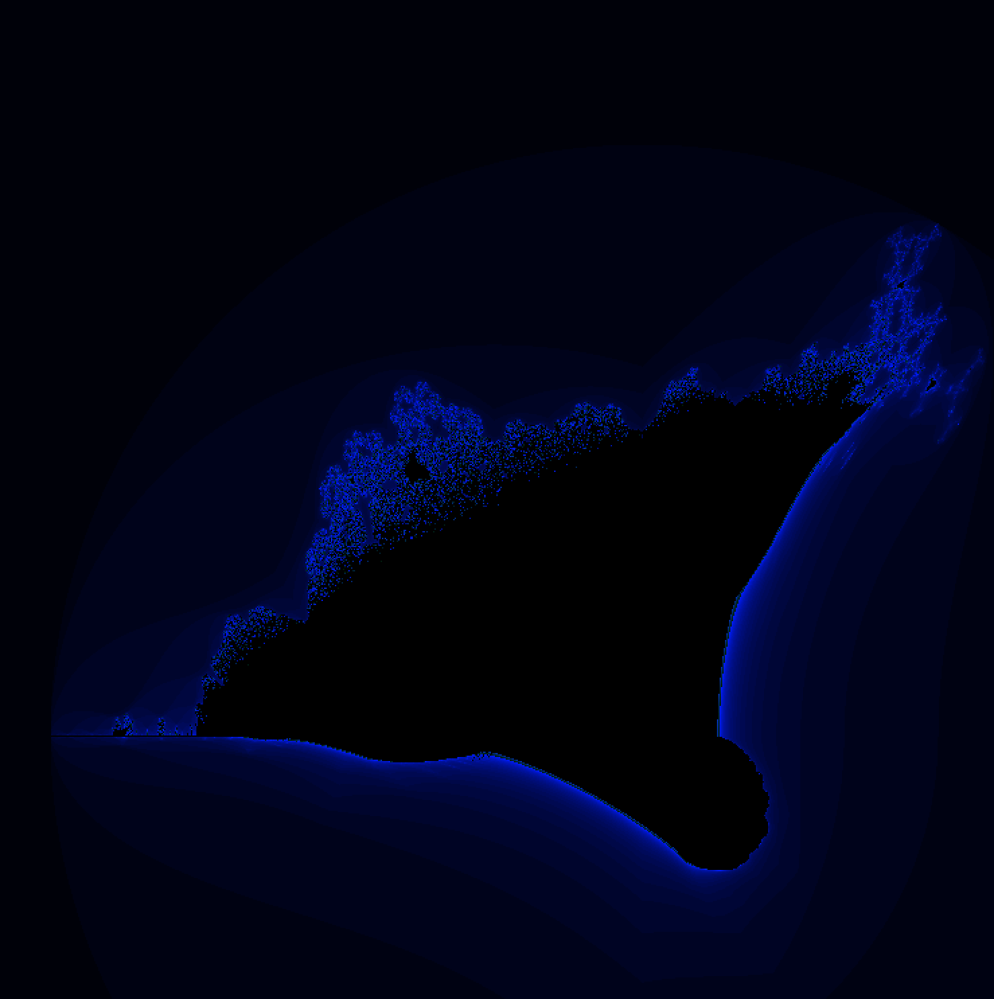

# fractol

Fractol is a 1337 project that help the student to undersrand fractals
in my projects i generated 4 fractals with the possibilty to control
the iterations and colors

* - julia
 
 
* - mandelbrot

* - tricorl

* - burningships

